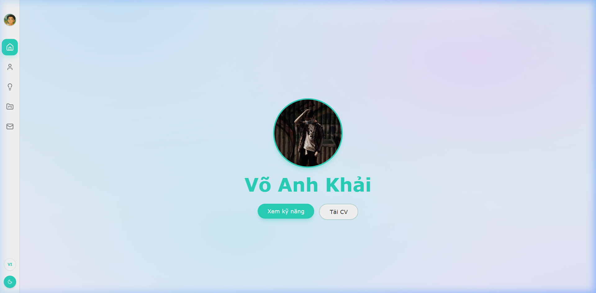

# Portfolio Website - Võ Anh Khải

## Mục Lục

1. [Giới Thiệu](#1-giới-thiệu)
2. [Công Nghệ Sử Dụng](#2-công-nghệ-sử-dụng)
3. [Kiến Trúc Hệ Thống](#3-kiến-trúc-hệ-thống)
4. [Giao Diện](#4-giao-diện)
5. [Hướng Dẫn Cài Đặt (Local)](#5-hướng-dẫn-cài-đặt-local)
6. [Tác Giả & Liên Hệ](#6-tác-giả--liên-hệ)

---

## 1. Giới Thiệu

Chào mừng bạn đến với trang web Portfolio cá nhân của **Võ Anh Khải**!

**Các tính năng nổi bật:**

- Phân trang (Pagination) mượt mà cho danh sách dự án.
- Tự động thay đổi tiêu đề trang (Dynamic Document Title).
- Chuyển đổi ngôn ngữ Anh / Việt (i18n) mượt mà không cần tải lại trang.
- Chế độ Sáng / Tối (Light/Dark Mode).
- Chuyển động và hiệu ứng (Animations/Transitions) đẹp mắt.

---

## 2. Công Nghệ Sử Dụng


---

## 3. Kiến Trúc Hệ Thống

Dự án tuân thủ nghiêm ngặt chuẩn kiến trúc Client-side Rendering (CSR) và nguyên tắc lập trình **SOLID**, với sự phân tách rõ ràng giữa Logic, View và Service:

### Các Lớp Logic (Logic Layers)

```text
+-------------------+   +-------------------------+   +-------------------+
|       VIEW        |   |       LOGIC / BUS       |   |   SERVICE / DAL   |
| (React Components)|<->| (Custom Hooks/Context:  |<->| (Dữ Liệu & API:   |
| - HomePage        |   | - useProjects           |   | - portfolioData.ts|
| - ProjectsPage    |   | - usePagination         |   | - LocalStorage)   |
| - Sidebar         |   | - Theme/Language Context|   |                   |
+-------------------+   +-------------------------+   +-------------------+
```

### Mô Hình Kiến Trúc (Architecture)

```text
+-------------------+       +-------------------+
|    MainLayout     |<----->|    ProjectsPage   |
| (Bố Cục Toàn Cục) |       | (Trang Hiển Thị)  |
+-------------------+       +-------------------+
          |                           |
          | Outlet Layer              | Sử dụng Hook
          v                           v
+-------------------+       +-------------------+
|   React Router    |       |   useProjects     |
|   (Navigation)    |       | (Logic & State)   |
+-------------------+       +-------------------+
                                      |
                                      | Nạp dữ liệu
                                      v
                            +-------------------+
                            |  portfolioData.ts |
                            |  (Dữ Liệu Tĩnh)   |
                            +-------------------+
```

### Luồng Xử Lý Phân Trang (Pagination Flow)

```text
[ NGƯỜI DÙNG ]                [ HỆ THỐNG / APP ]
      |                               |
      | (1) Nhấn "Trang tiếp theo"    |
      |------------------------------>|
      |                               | (2) usePagination: Cập nhật biến current = current + 1
      |                               |
      |                               | (3) useProjects: slice(từ index A đến B)
      | <-----------------------------|
      | (4) Giao diện cập nhật dự án  |
      |                               |
```

---

## 4. Giao Diện



---

## 5. Hướng Dẫn Cài Đặt (Local)

**Yêu cầu môi trường:** Đảm bảo máy tính đã cài đặt **Node.js** (Phiên bản v18 trở lên).

**Bước 1: Clone repository**

```bash
git clone https://github.com/KaitoDeus/Portfolio.git
cd Portfolio
```

**Bước 2: Cài đặt Dependencies**

```bash
npm install
```

**Bước 3: Khởi chạy Development Server**

```bash
npm run dev
```

Sau đó truy cập vào [http://localhost:5173](http://localhost:5173) để xem dự án trên trình duyệt.

**Bước 4: Build cho Production**

```bash
npm run build
```

---

## 6. Tác Giả & Liên Hệ

- **Email**: [khaivo300605@gmail.com](mailto:khaivo300605@gmail.com)
- **LinkedIn**: [Võ Anh Khải](https://www.linkedin.com/in/kaitodeus/)
- **GitHub**: [KaitoDeus](https://github.com/KaitoDeus)
