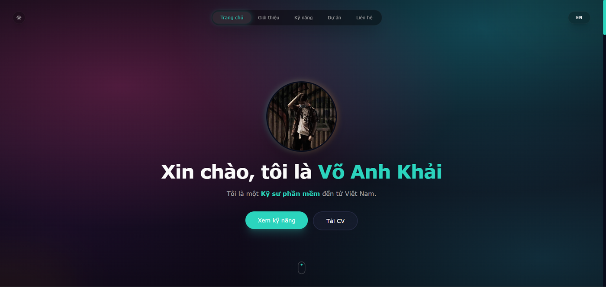

# Portfolio Website - Vo Anh Khai

## Table of Contents

1. [Introduction](#1-introduction)
2. [Tech Stack](#2-tech-stack)
3. [System Architecture](#3-system-architecture)
4. [Interface](#4-interface)
5. [Installation Guide (Local)](#5-installation-guide-local)

---

## 1. Introduction

Welcome to **Vo Anh Khai's** personal Portfolio website!

**Key Features:**

- Smooth Pagination for the project list.
- Dynamic Document Title updates.
- Seamless English / Vietnamese language switching (i18n) without page reload.
- Light / Dark Mode support.
- Eye-catching Animations & Transitions.

---

## 2. Tech Stack


---

## 3. System Architecture

The project strictly follows the **Client-side Rendering (CSR)** architecture and **SOLID** principles, with a clear separation between Logic, View, and Service:

### Logic Layers

```text
+-------------------+   +-------------------------+   +-------------------+
|       VIEW        |   |       LOGIC / BUS       |   |   SERVICE / DAL   |
| (React Components)|<->| (Custom Hooks/Context): |<->| (Data & API):     |
| - HomePage        |   | - useProjects           |   | - portfolioData.ts|
| - ProjectsPage    |   | - usePagination         |   | - LocalStorage)   |
| - Sidebar         |   | - Theme/Language Context|   |                   |
+-------------------+   +-------------------------+   +-------------------+
```

### Architecture Model

```text
+-------------------+       +-------------------+
|    MainLayout     |<----->|    ProjectsPage   |
| (Global Layout)   |       | (Display Page)    |
+-------------------+       +-------------------+
          |                           |
          | Outlet Layer              | Uses Hook
          v                           v
+-------------------+       +-------------------+
|   React Router    |       |   useProjects     |
|   (Navigation)    |       | (Logic & State)   |
+-------------------+       +-------------------+
                                      |
                                      | Load Data
                                      v
                            +-------------------+
                            |  portfolioData.ts |
                            |  (Static Data)    |
                            +-------------------+
```

### Pagination Flow

```text
[ USER ]                      [ SYSTEM / APP ]
    |                               |
    | (1) Clicks "Next Page"        |
    |------------------------------>|
    |                               | (2) usePagination: Update current = current + 1
    |                               |
    |                               | (3) useProjects: slice(from index A to B)
    | <-----------------------------|
    | (4) UI updates project list   |
    |                               |
```

---

## 4. Interface



---

## 5. Installation Guide (Local)

**Prerequisites:** Ensure **Node.js** (v18 or higher) is installed on your machine.

**Step 1: Clone the repository**

```bash
git clone https://github.com/KaitoDeus/Portfolio.git
cd Portfolio
```

**Step 2: Install Dependencies**

```bash
npm install
```

**Step 3: Launch Development Server**

```bash
npm run dev
```

Then visit [http://localhost:5173](http://localhost:5173) to view the project in your browser.

**Step 4: Build for Production**

```bash
npm run build
```
